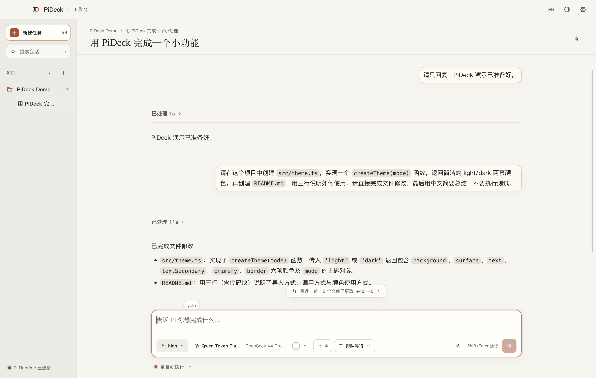
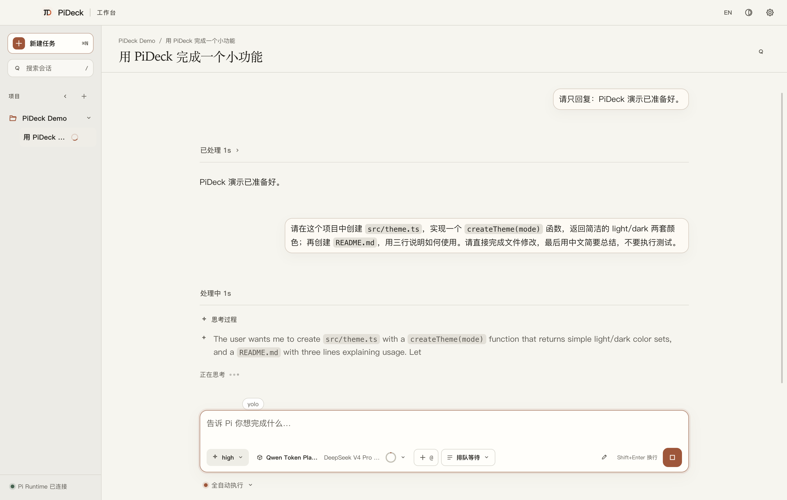
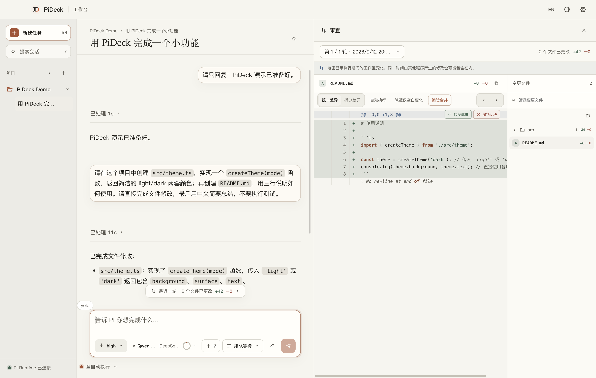
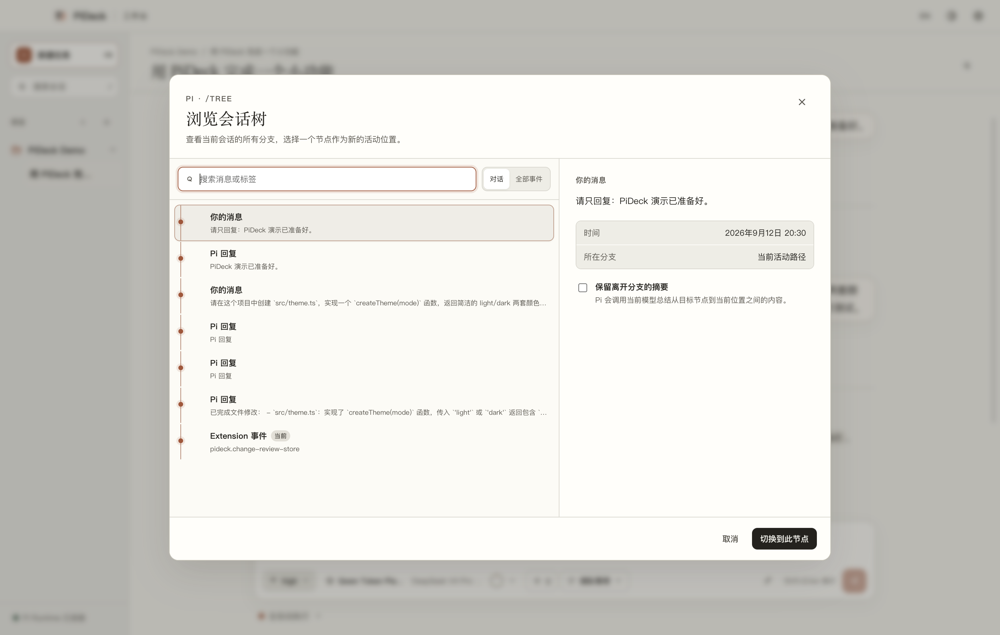
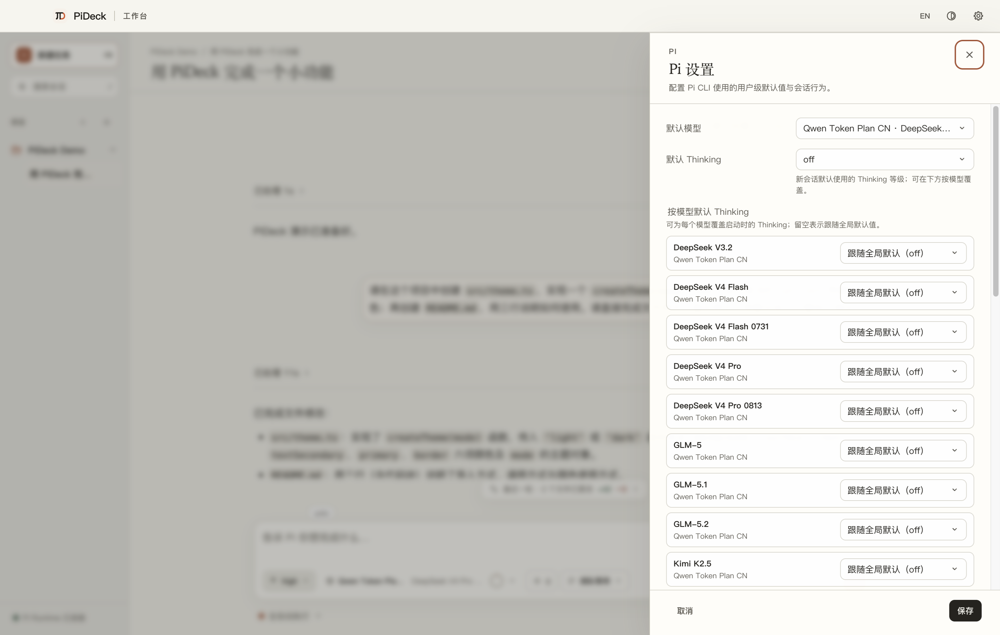
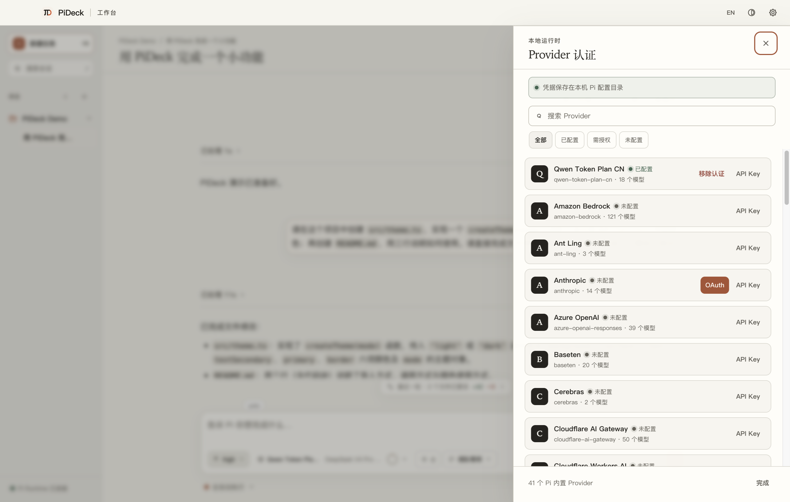
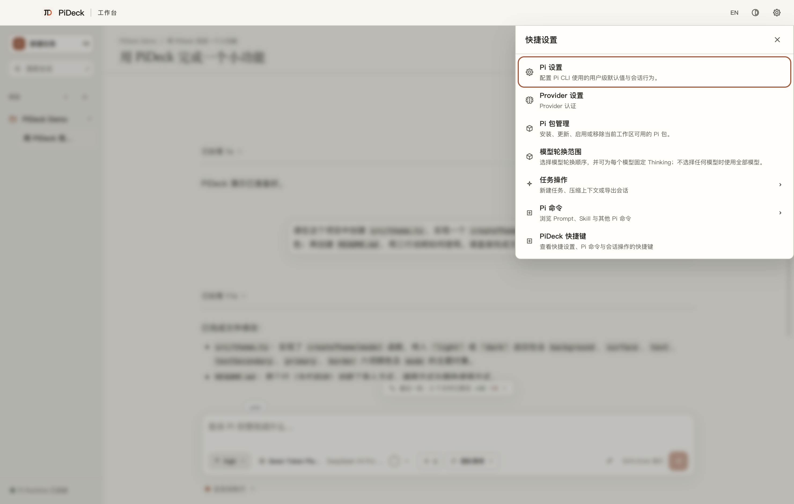

# PiDeck

[中文](README.md)

[](https://github.com/vulcanen/PiDeck/actions/workflows/ci.yml)
[](https://github.com/vulcanen/PiDeck/releases)
[](#beta-status)
[](LICENSE)

PiDeck is an unofficial desktop interface for [Pi](https://github.com/earendil-works/pi). It brings projects, sessions, models, tool calls, and approvals into one local application. Pi still runs the agent, talks to model providers, stores sessions, and manages credentials.

> PiDeck is independently maintained and is not affiliated with the Pi project.

Current compatibility baseline: Pi CLI / SDK `0.85.1`, Electron `43.4.1`.

## Beta status

PiDeck is currently in Beta. Its core workflows are usable, but interface details, compatibility, and installation may still change. Keep important work recoverable with Git or another backup, and review the [changelog](CHANGELOG.md) before upgrading.

## Pi on the desktop, without a second agent

PiDeck does not build a second agent around Pi. It also does not maintain its own model catalog, credential vault, or session database. Models, commands, tools, sessions, extensions, packages, and permission state shown in the app come from the Pi CLI / SDK.

Beyond desktop interaction and presentation, PiDeck does not add product capabilities that Pi itself does not have. When a Pi capability cannot yet be mapped faithfully to the desktop, PiDeck leaves it in the CLI instead of presenting a substitute. The aim is simple: keep Pi's speed and small surface area while making everyday interaction comfortable on the desktop.



## Features

- Manage multiple projects and sessions from the sidebar.
- Configure providers, API keys, OAuth, models, and thinking levels.
- Follow responses, thinking, tool calls, results, and execution time as they arrive.
- Approve tool calls, change permissions, and manage Steering / Follow-up queues.
- Use Pi slash commands, prompts, skills, extensions, and packages.
- Browse conversation branches with `/fork`, `/clone`, and `/tree`; review each run's file changes, accept or revert individual hunks, and edit the merged result directly.
- Render Markdown, code, Mermaid diagrams, and math, with Chinese/English and light/dark themes.

See the [Pi CLI → PiDeck feature matrix](docs/pi-cli-feature-matrix.en.md) for a complete list of supported and unsupported features.

## Interface tour

The screens below come from a real `Qwen Token Plan CN / DeepSeek V4 Pro 0813` run in an isolated demo workspace.

### Live execution

Thinking, tool calls, and execution state appear in event order. Once the run settles, the details move into an expandable execution summary.



### File-change review

Changes from each run can be browsed by file, viewed as unified or split diffs, accepted or reverted per hunk, and edited in a merge view.



### Session tree

`/tree`, `/fork`, and `/clone` use Pi's Session capabilities directly, so branch browsing and navigation do not introduce another session format.



### Pi settings and providers

Default models, thinking levels, and other session behavior are written to Pi's settings. Provider credentials remain in Pi's local configuration directory and never enter the Renderer.





Quick settings keeps Pi settings, providers, packages, model scope, task actions, and commands in one panel.



## Downloads and system requirements

Download the latest public version from [GitHub Releases](https://github.com/vulcanen/PiDeck/releases):

| Platform | Requirement | Installer |
| --- | --- | --- |
| Windows | Windows 10 / 11, x64 | `PiDeck-VERSION-windows-x64-setup.exe` |
| macOS Apple Silicon | macOS 12 Monterey or later, arm64 | `PiDeck-VERSION-macos-arm64.dmg` |
| macOS Intel | macOS 12 Monterey or later, x64 | `PiDeck-VERSION-macos-x64.dmg` |
| Linux | No release-validated installer yet | — |

Replace `VERSION` with the version shown on the Release page. If About This Mac shows a “Chip,” choose arm64; if it shows a “Processor,” choose Intel x64.

The installer includes Pi SDK `0.85.1`, so Pi CLI does not need to be installed separately. `PIDECK_PI_MODULE` is only needed for development and compatibility testing.

## Installation

### Windows

1. Download `PiDeck-VERSION-windows-x64-setup.exe`.
2. Run the NSIS installer and choose an installation directory if needed.
3. Start PiDeck from the Start menu or its installation directory.

### macOS

1. Download the arm64 or x64 DMG for your Mac.
2. Open the DMG and drag PiDeck into Applications.
3. Start PiDeck from Applications. If macOS blocks an unsigned build, confirm that you want to open it in System Settings → Privacy & Security.

## First run

1. Add a local project directory, or select a project from existing Pi sessions.
2. Authenticate with an API key or OAuth in Provider settings.
3. Select a model, thinking level, and tool permission level.
4. Create or open a session and start a conversation.

Projects, sessions, provider credentials, and Pi Package settings remain stored locally by Pi. PiDeck only adds the project list and UI preferences; removing a project from the sidebar does not delete its files or Pi sessions.

PiDeck supports `HTTP_PROXY`, `HTTPS_PROXY`, `NO_PROXY`, Pi's `httpProxy` setting, and the system proxy, with environment variables taking priority. OAuth login still happens in the system browser.

PiDeck does not collect usage analytics. Code and conversations you send are handled by the selected model provider, so review that service's privacy policy.

Tools and extensions may read or modify project files and run commands. Check third-party packages before using them and choose an appropriate permission level.

## Verify downloads

Each Release includes `SHA256SUMS.txt` and a CycloneDX SBOM for every platform. Use the commands below to check the installer hash; GitHub Artifact Attestations can confirm that the file came from this repository's release workflow.

macOS:

```bash
shasum -a 256 PiDeck-VERSION-macos-arm64.dmg
grep 'PiDeck-VERSION-macos-arm64.dmg' SHA256SUMS.txt
```

Windows PowerShell:

```powershell
Get-FileHash .\PiDeck-VERSION-windows-x64-setup.exe -Algorithm SHA256
Select-String -Path .\SHA256SUMS.txt -Pattern 'PiDeck-VERSION-windows-x64-setup.exe'
```

Use `x64` instead of `arm64` in the macOS example for an Intel Mac.

## Current limitations

- No Linux release installer is currently provided.
- There is no in-app auto-update yet; new versions are published through GitHub Releases.
- There is no standalone local terminal panel; shell commands remain available through Pi tools and `!command` / `!!command`.
- Binary, oversized, or truncated file diffs cannot be resolved per hunk or edited in the merge view.
- Print, JSON, RPC, stdin, and Auth Print do not have desktop screens; use `npm run cli` or `pideck-cli` instead.
- Extensions that depend on pixel-level terminal rendering or arbitrary DOM still require Pi CLI.
- Compatibility is currently guaranteed only for Pi SDK `0.85.1`.

## Run from source

Requirements:

- Node.js `>=22.19.0`
- npm
- Xcode Command Line Tools on macOS, used to compile the native minimized-window extension

Install the locked dependencies and start the development application:

```bash
npm ci
npm run dev
```

To use Pi's Print, JSON, RPC, stdin JSONL, or `auth print-*` commands, run them through PiDeck's CLI entry point:

```bash
npm run cli -- --help
npm run cli -- --mode rpc --no-session
npm run cli -- auth print-api-key --provider openai
```

Run the project checks:

```bash
npm run lint
npm run typecheck
npm run test:renderer
npm run build
npm run smoke:runtime
npm run smoke:cli
npm run notices:check
npm ls --all
```

Package on the current machine:

```bash
npm run package:win:x64
npm run package:mac
```

`package:mac` packages the current Mac's native architecture. `package:mac:arm64` and `package:mac:x64` are intended for matching CI runners; cross-building an installer with native dependencies is not recommended.

The source installation already contains the compatible Pi SDK. An SDK path override is normally needed only for development, compatibility testing, or troubleshooting:

```bash
export PIDECK_PI_MODULE="/path/to/pi-coding-agent/dist/index.js"
```

Windows PowerShell:

```powershell
$env:PIDECK_PI_MODULE = "D:\path\to\pi-coding-agent\dist\index.js"
```

## Release and project documentation

- [v0.2.0 first open-source Beta release notes](docs/releases/v0.2.0.md)
- [Release maintainer guide](docs/releasing.en.md)
- [Changelog](CHANGELOG.md)
- [Product and technical plan](docs/product-plan.en.md)
- [Architecture](docs/architecture.en.md)
- [Pi CLI feature matrix](docs/pi-cli-feature-matrix.en.md)
- [Network acceptance matrix](docs/network-acceptance-matrix.en.md)
- [Development guide and project rules](AGENTS.md)

## Contributing

- [Report a bug or request a feature](https://github.com/vulcanen/PiDeck/issues/new)
- Report security issues privately according to the [security policy](SECURITY.md)
- Read the [contribution guide](CONTRIBUTING.md) before submitting code
- Follow the [Code of Conduct](CODE_OF_CONDUCT.md) when participating
- PiDeck is licensed under the [MIT License](LICENSE)
- Bundled dependency licensing is listed in [Third-Party Notices](THIRD_PARTY_NOTICES.txt)
