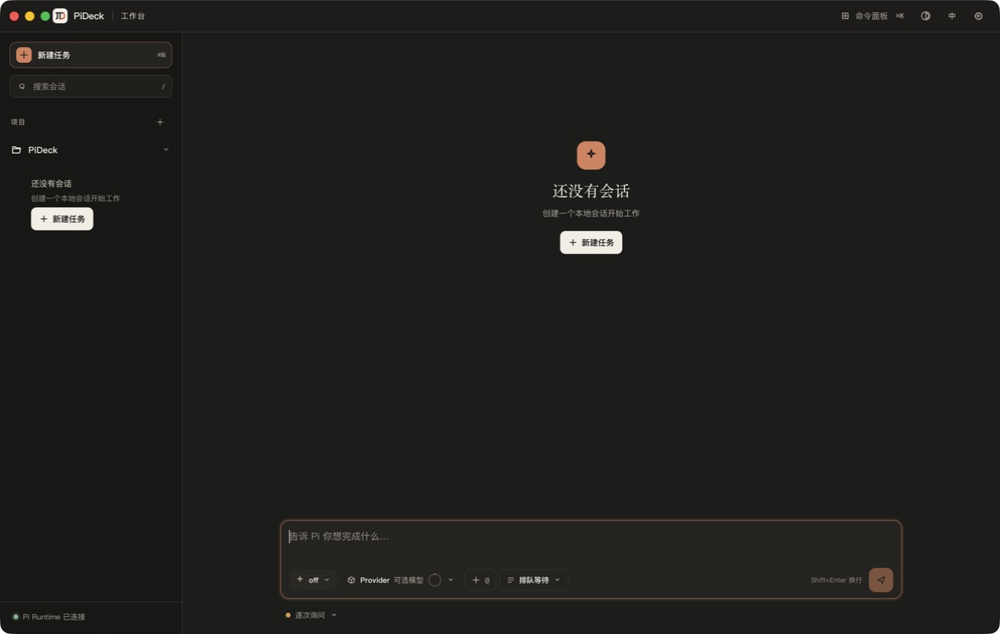

# PiDeck

[中文](README.md)

[](https://github.com/vulcanen/PiDeck/actions/workflows/ci.yml)
[](https://github.com/vulcanen/PiDeck/releases/latest)
[](LICENSE)

PiDeck is an open source desktop interface for [Pi](https://github.com/earendil-works/pi). It brings the projects, sessions, models, providers, tools, and extensions exposed by the Pi CLI / SDK into one Electron workspace.

> **Notice**: PiDeck is an independent, unofficial project. It is not affiliated with or endorsed by the Pi project or its maintainers. PiDeck does not implement a second agent, model catalog, session store, or credential system; the Pi CLI / SDK remains authoritative for those capabilities.

Current compatibility baseline: Pi CLI / SDK `0.84.2`, Electron `43.3.0`.



## Features

- Browse multiple projects and their Pi sessions, with a separate workspace for each conversation.
- Configure providers, API keys, OAuth, models, and thinking levels from the desktop UI.
- Follow streaming responses, thinking, tool calls, results, and execution durations.
- Use tool approvals, permission levels, and Steering / Follow-up message queues.
- Use Pi slash commands, prompts, skills, extension commands, and Pi Package management.
- Render Markdown, code, Mermaid diagrams, and math while preserving each session's reading position.
- Switch between Chinese and English as well as light and dark themes.

See the [Pi CLI → PiDeck feature matrix](docs/pi-cli-feature-matrix.en.md) for the authoritative implemented and pending scope.

## Downloads and system requirements

Download the latest public version from [GitHub Releases](https://github.com/vulcanen/PiDeck/releases/latest):

| Platform | Requirement | Installer |
| --- | --- | --- |
| Windows | Windows 10 / 11, x64 | `PiDeck-VERSION-windows-x64-setup.exe` |
| macOS Apple Silicon | macOS 12 Monterey or later, arm64 | `PiDeck-VERSION-macos-arm64.dmg` |
| macOS Intel | macOS 12 Monterey or later, x64 | `PiDeck-VERSION-macos-x64.dmg` |
| Linux | No release-validated installer yet | — |

Replace `VERSION` in the filename with the version shown on the Release. If About This Mac shows a “Chip,” choose arm64; if it shows a “Processor,” choose Intel x64.

PiDeck installers contain the project's locked Pi SDK and do not require a separate Pi CLI installation. Official installers always prefer the bundled `0.84.2`; only an explicit `PIDECK_PI_MODULE` override replaces it for development or compatibility testing.

## Installation

### Windows

1. Download `PiDeck-VERSION-windows-x64-setup.exe`.
2. Run the NSIS installer and choose an installation directory if needed.
3. Start PiDeck from the Start menu or its installation directory.

### macOS

1. Download the arm64 or x64 DMG for your Mac.
2. Before installation, enable “Allow applications from anywhere” in System Settings → Privacy & Security.
3. Open the DMG and drag PiDeck into Applications.
4. Start PiDeck from Applications.

## First run

1. Add a local project directory, or select a project from existing Pi sessions.
2. Authenticate with an API key or OAuth in Provider settings.
3. Select a model, thinking level, and tool permission level.
4. Create or open a session and start a conversation.

Pi sessions, provider credentials, OAuth, and Pi Package configuration are managed by the local Pi Runtime and can be shared with a compatible Pi CLI environment. PiDeck itself stores only project directory references, display order, and UI preferences in Electron `userData`; removing a project from the sidebar does not delete project files or Pi sessions.

PiHost network requests use the same proxy-aware dispatcher as Pi CLI. Explicit `HTTP_PROXY` / `HTTPS_PROXY` / `NO_PROXY` environment variables take priority, followed by Pi's global `httpProxy` setting, then the system proxy resolved by Electron for each request target on Windows, macOS, or Linux; PAC, bypass, and domain-specific rules therefore remain effective. OAuth pages in the browser remain under the system browser and Provider's control.

PiDeck does not configure an analytics or telemetry exporter. Provider requests are still handled by the selected Pi Runtime and model service; evaluate code and session content under the corresponding provider's privacy policy before sending it.

Agent tools and extensions may read or modify project files or execute commands according to the active permission settings. Review the source of third-party packages and choose an appropriate approval level before using them.

## Verify downloads

Every Release includes `SHA256SUMS.txt` plus a CycloneDX SBOM generated from the final packaged contents of each macOS arm64, macOS x64, and Windows x64 installer. Download the checksum file alongside the installer and compare the matching hash; GitHub Artifact Attestations can additionally verify that assets came from the repository's release workflow.

macOS:

```bash
shasum -a 256 PiDeck-VERSION-macos-arm64.dmg
grep 'PiDeck-VERSION-macos-arm64.dmg' SHA256SUMS.txt
```

Windows PowerShell:

```powershell
Get-FileHash .\PiDeck-VERSION-windows-x64-setup.exe -Algorithm SHA256
Select-String -Path .\SHA256SUMS.txt -Pattern 'PiDeck-VERSION-windows-x64-setup.exe'
```

Use `x64` instead of `arm64` in the macOS example for an Intel Mac.

## Current limitations

- No Linux release installer is currently provided.
- There is no in-app auto-update yet; new versions are published through GitHub Releases.
- The local terminal panel is not integrated; shell execution remains available through Pi Agent's real tools.
- `/fork`, `/clone`, `/tree`, and complete Session Tree navigation are not yet mapped to the desktop UI.
- Diff preview, task-baseline diff, and hunk-by-hunk review are not implemented.
- An explicitly overridden external Pi SDK may change API behavior; versions other than `0.84.2` are outside the current compatibility guarantee.

## Run from source

Requirements:

- Node.js `>=22.19.0`
- npm
- Xcode Command Line Tools on macOS, used to compile the native minimized-window extension

Install the locked dependencies and start the development application:

```bash
npm ci
npm run dev
```

Run the project checks:

```bash
npm run lint
npm run typecheck
npm run test:renderer
npm run build
npm run smoke:runtime
npm run notices:check
npm ls --all
```

Package on the current machine:

```bash
npm run package:win:x64
npm run package:mac
```

`package:mac` packages the current Mac's native architecture. `package:mac:arm64` and `package:mac:x64` are intended for matching CI runners; cross-building an installer with native dependencies is not recommended.

The source installation already contains the compatible Pi SDK. An SDK path override is normally needed only for development, compatibility testing, or troubleshooting:

```bash
export PIDECK_PI_MODULE="/path/to/pi-coding-agent/dist/index.js"
```

Windows PowerShell:

```powershell
$env:PIDECK_PI_MODULE = "D:\path\to\pi-coding-agent\dist\index.js"
```

## Release and project documentation

- [Release maintainer guide](docs/releasing.en.md)
- [Changelog](CHANGELOG.md)
- [Product and technical plan](docs/product-plan.en.md)
- [Architecture](docs/architecture.en.md)
- [Pi CLI feature matrix](docs/pi-cli-feature-matrix.en.md)
- [Development guide and project rules](AGENTS.md)

## Contributing

- [Report a bug or request a feature](https://github.com/vulcanen/PiDeck/issues/new)
- Report security issues privately according to the [security policy](SECURITY.md)
- Read the [contribution guide](CONTRIBUTING.md) before submitting code
- Follow the [Code of Conduct](CODE_OF_CONDUCT.md) when participating
- PiDeck is licensed under the [MIT License](LICENSE)
- Bundled dependency licensing is listed in [Third-Party Notices](THIRD_PARTY_NOTICES.txt)
